# Distant Reading, практика и демо
Сегодня мы немножко поговорим о том, какими методами и инструментами можно делать Distant Reading текстов.  

## Disclaimer
Результаты количественного анализа больших объемов текста **не всегда хорошо интерпретируемы**. Это может быть связано с:
* нашим недостаточным знанием материала
* плохим выбором того, "что считать"
* неудачно подобранным набором текстов
* отсутствием черной кошки в темной комнате... 🐈

В этой части мы исследуем методы и учимся их применять. Если получается интересное -- это хорошо, но цель в освоении методов.

## Введение: а что мы вообще можем?
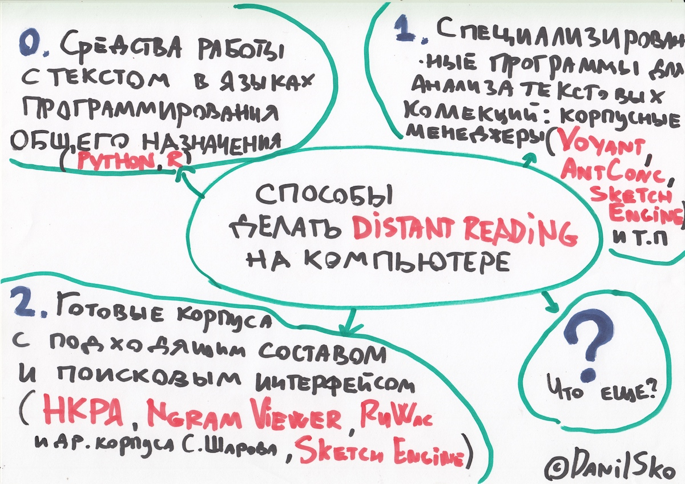

## Про способ № 2 (использование готовых корпусов) мы с вами уже немного поговорили, когда обсуждали Ngram Viewer

Вот еще примеры использования [НКРЯ](http://ruscorpora.ru) для distant reading'а:
* [Корпусный анализ русского стиха (видео Б.В. Орехова на постнауке)](https://postnauka.ru/video/85900 "Кликни и увидь")
* [Разные публикации Б.В. Орехова"](http://nevmenandr.net/bo.php), в которых есть слово "корпусный
* [A.A. Bonch-Osmolovskaya, Two Centuries of Russian Roads – Diachronic Study of Polysemy in the Context of Cultural Change](https://dh2016.adho.org/abstracts/413 "Кликни и прочти")
* [А.А. Бонч-Осмоловская, Корпусные наблюдения над портретами героев в "Войне и мире"](http://veeb.ut.ee/FLVE/ruslit/sobolev/1.pdf "Кликни и прочти")

## Теперь поговорим про способы № 1 (готовые корпусные менеджеры) и потом № 0 (на примере Python)

## Способ 1: корпусные менеджеры

### Voyant Tools

Вот [Voyant Tools](https://voyant-tools.org/) — популярный инструмент для входа в Digital Humanities. Простой, но имеет ограничения.

### Загрузка текста Voyant

### Copy->Paste

👩‍💻 Откройте [главную страницу Voyant Tools](https://voyant-tools.org/) и попробуйте туда что-нибудь вставить, любой текст. Например:

<i>
Distant reading is an approach in literary studies that applies computational methods to literary data, usually derived from large digital libraries, for the purposes of literary history and theory. Other terms used to refer to the same or similar approach include macroanalysis, cultural analytics, computational formalism, computational literary studies, quantitative literary studies, and algorithmic literary criticism.
The term "distant reading" is generally attributed to Franco Moretti and his 2000 article, Conjectures on World Literature. In the article, Moretti proposed a mode of reading which included works outside of established literary canons, which he variously termed "the great unread" and, elsewhere, "the Slaughterhouse of Literature". The innovation it proposed, as far as literary studies was concerned, was that the method employed samples, statistics, paratexts, and other features not often considered within the ambit of literary analysis. Moretti also established a direct opposition to the theory and methods of close reading: "One thing for sure: it cannot mean the very close reading of very few texts—secularized theology, really ('canon'!)—that has radiated from the cheerful town of New Haven over the whole field of literary studies".
However, Moretti initially conceived distant reading for analysis of secondary literature as a roundabout way of getting to know more about primary literature: "[literary history] will become 'second-hand': a patchwork of other people's research, without a single direct textual reading". Only later did the term distant reading (via Moretti and other scholars) come to become primarily identified with computational analysis of primary literary sources.
Despite the consensus about the origins of distant reading at the turn of the twenty-first century, Ted Underwood has traced a longer genealogy of the method, arguing for its elision in current discourse about distant reading. He writes that "distant reading has a largely distinct genealogy stretching back many decades before the advent of the internet – a genealogy that is not for the most part centrally concerned with computers". Underwood emphasises a social-scientific dimension in this prehistory of distant reading, referring to particular examples in the work of Raymond Williams (from the 1960s) and Janice Radway (from the 1980s).
This variety in the stated definitions and aims of distant reading is characteristic of its development since the turn of the twenty-first century, where is has come to encompass a variety of different methods and approaches, rather than representing a single or unified method of literary study.</i>

### загрузка HTML-страница

👩‍💻 Еще Voyant умеет принимать URL -- и анализировать текст HTML-страницы. Попробуйте вставить туда URL. Например: https://en.wikipedia.org/wiki/Distant_reading

### Загрузка текстового файла

👩‍💻 Ну а теперь попробуйте загрузить целый текстовый файл, например, [этот](orwell.zip) (надо скачать по ссылке и распаковать).

### Загрузка корпуса текстов в Voyant

В Voyant Tools можно запихнуть и целый корпус, чтобы потом поисследовать. Для этого просто загружаете через тот же Upload несколько файлов. Конечно, это не может быть корпус размером с НКРЯ или больше. Но небольшой корпус на пару сотен мегабайт влезть может, а это для филологии уже практически Бигдата :)

Например вот тут **[корпус русской фантастики](https://voyant-tools.org/?corpus=ad00c40ec4549bc30c185cf7f65c9318)** (193 произведения, 128 мб текста, 10,7 млн словоупотреблений), собранный нашими магистрами и загруженный мной в Voyant.

Вот еще несколько моих примеров поменьше:

* [Главная страница Интерфакса за 3 месяца: январь-март 2014](https://voyant-tools.org/?corpus=8943e7b961f87daf226162f5a3f5e8da).
* ["Война и мир" по томам](https://voyant-tools.org/?corpus=d6d851113e8787d79055aa1b434a37bd)
* [Преступление и наказание](https://voyant-tools.org/?corpus=7a14151684244d604e29fed45c15ddee)

👩‍💻 Можете попробовать загрузить свой корпус. Например, [такой](asoiaf.zip)

### Полезный факт: Voyant Tools можно запускать и локально

Вам понадобится скачать Voyant Server [отсюда](http://docs.voyant-tools.org/resources/run-your-own/voyant-server/) (тут же есть все инструкции) и еще установить Java. После запуска VoyantServer.jar ваш компьютер запустит локальный сервер, который будет делать то же самое, что и онлайновый Voyant, но прямо на вашем компьютере.

NB: Качать Voyant Server сейчас через вышкинскую сеть не надо, он сравнительно тяжелый; лучше возьмите у меня дистрибутив на диске/флешке

## Частотности слов и конструкций, добавление/редактирование списка стоп-слов

Облако с частотностями слов (вордклауд) по умолчанию в левом верхнем окошке (этот инструмент в Voyant называется Cirrus). Я уже лемматизировал все загруженные корпуса (подробнее об этом есть в питоновской тетрадке [по ссылке](https://github.com/dhhse/dhcourse/blob/master/dr_practice/first_dr_notebook_danya.ipynb)). Поэтому вордклауд, который вам по умолчанию выдает Voyant в левом окошке, в нашем случае основан на частотностях лемм ☝️

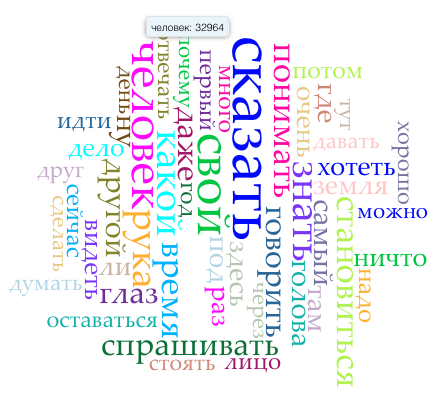

*почти 33 тыс. раз упоминаются люди и человеки в нашем корпусе фантастики!*

Через Scale можно выбрать показ облака для всего корпуса, или для отдельных документов. При помощи слайдера под облаком можно отрегулировать количество слов в облаке.

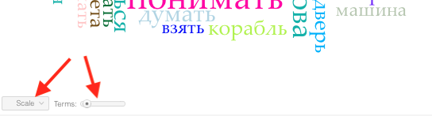

Сами частотности можно посмотреть во вкладке Terms (кнопка над облаком):

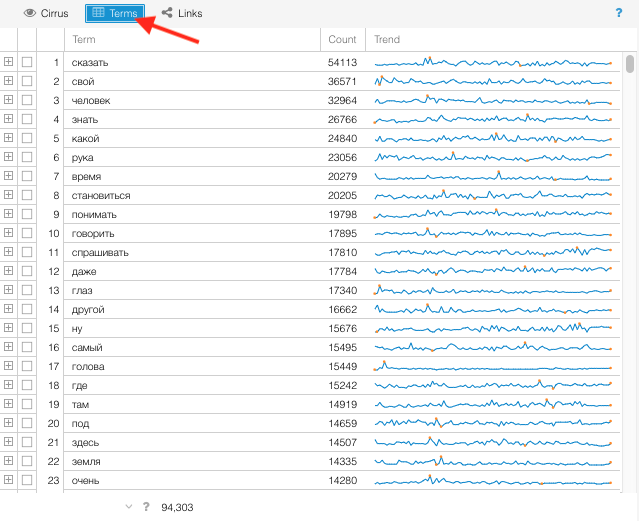

Как видите, тут довольно много служебных и околослужебных слов, которые нам неинтересны, вроде свой. А еще совсем недавно Voyant вообще не знал русских стоп-слов, и при первой загрузке получалось что-то такое:

К счастью, в Voyant есть функционал заливки списка стоп-слов. Можно вставить туда свой список:

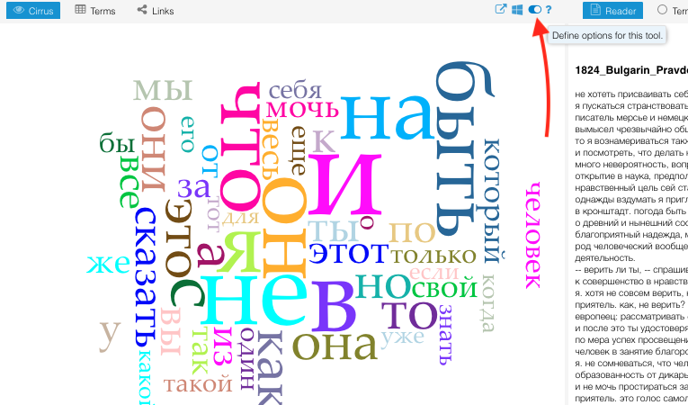

Вот мои [стоп-слова](stop_ru.txt), украденные из интернета. После применения стоп-слов получается что-то такое:

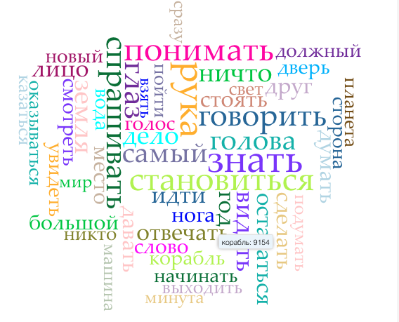

*Корабль? Машина? Это уже чуть-чуть интереснее!*

👩‍💻 Попробуйте загрузить [стоп-слова](stop_ru.txt) и увидеть изменения.

## Графики 📈

Voyant часто используют для построения графиков (а ля Google Ngram Viewer, но на вашем материале). Если ваш корпус имеет временн*у*ю протяженность, это бывает интересно.

Ср. например, радио* (т.е. все слова, начинающиеся на "радио") и слово компьютер:
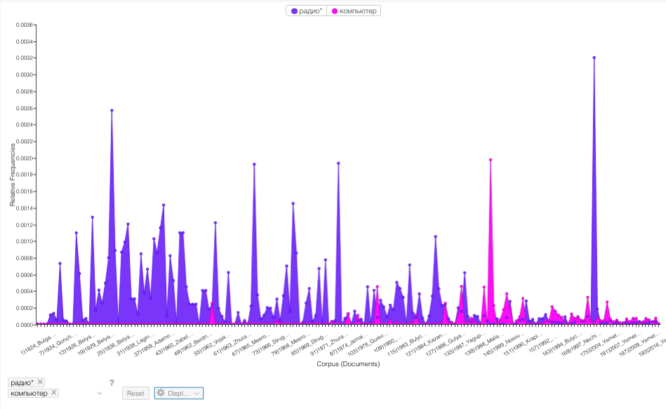

А вот пример из корпуса [Интерфакса за январь-март 2014](https://voyant-tools.org/?corpus=8943e7b961f87daf226162f5a3f5e8da) — слова "украина","олимпиада", "крым":

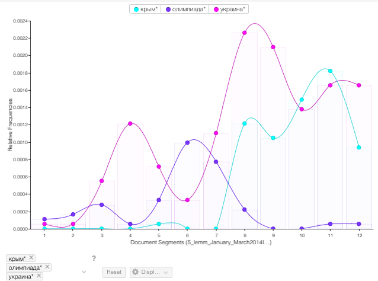

👩‍💻 Попробуйте воспроизвести этот график

В ["Войне и мире"](https://voyant-tools.org/?corpus=d6d851113e8787d79055aa1b434a37bd) интересно смотреть на слова типа "войско", "армия" (военные) и наоборот мирные, типа "комната",

## Коллокации в Voyant

TermsBerry предоставляет такую же визуализацию частотных слов, что и Cirrus, но более полезна для исследования коллокатов: при наведении на слово подсвечиваются слова, которые встречаются рядом с выделенным. Определение “рядом”, то есть того, на каком расстояние слово должно находиться от выделенного чтобы считаться соседним, можно отрегулировать при помощи слайдера Context. Во вкладке Strategy можно переключиться между просто частотными словами, и “значимыми” словами - которые могут встречаться редко, но в определенных документах намного чаще, чем в других.

## Прочие окошки в Voyant

### Reader
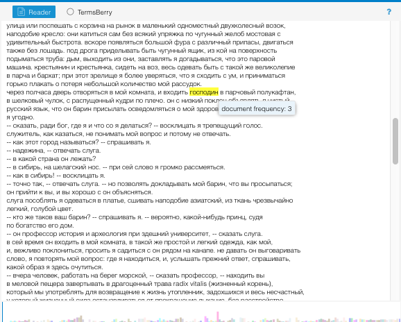

Панель Reader позволяет просматривать корпус как один непрерывный текст. Расположение читаемого текста относительно всего корпуса представлено внизу в виде разноцветных столбиков. Каждый столбик - это отдельный документ в корпусе. Его высота и ширина зависят от объема этого документа.
При наведении на слово можно посмотреть на его частоту в документе.

### Summary

Панель Summary предлагает различную информацию и статистику о корпусе вообще и о некоторых документах: самые значимые слова для разных документов, количество слов в документе, среднюю длину предложений и т.д.
Также умеет выделять "наиболее специфические" слова данного корпуса.

## Тематическое моделирование
Тематическое моделирование — отдельная большая тема. Я показывал пример во [вводной презентации](https://danilsko.github.io/slides/dhminor/intro.html#/29). Подробнее сейчас не успеть. Есть туториалы на "Системном Блоке": [сложный в MALLET](https://sysblok.ru/nlp/ishhem-smysly-kak-sdelat-tematicheskoe-modelirovanie-korpusa-tekstov/), [попроще в TopicModeling Tool](https://sysblok.ru/courses/kak-delat-tematicheskoe-modelirovanie-bez-boli-i-komandnoj-stroki/)

Воянт тоже умеет в тематическое моделирование, можно посмотреть на примере ["Войны и мира"](https://voyant-tools.org/?corpus=d6d851113e8787d79055aa1b434a37bd)

## AntConc

[AntConc](http://www.laurenceanthony.net/software.html) — саперная лопатка мира корпусных менеджеров. Простая, но с ограниченными возможностями. Тем не менее там есть кое-что, чего нет в Voyant. Например:
* Более умные меры подсчета коллокаций
* Возможность загрузить словарь лемм, чтобы тексты лемматизировались прямо внутри программы
* Контрастивный анализ (выделение слов, которые характеризуют ваш корпус относительно какого-то референтного корпуса)
* К тому же AntConc приятнее тем, что он простая и маленькая десктопная программка

👩‍💻 Можете попробовать загрузить[ свой корпус ](asoiaf.zip) в AntConc. Нужно:

1. пойти в File => Open File(s):

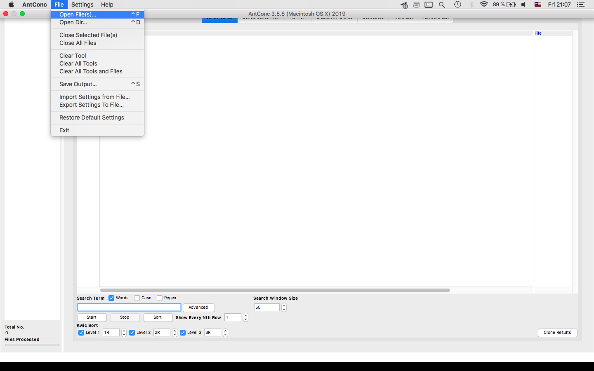

2. выбрать нужные файлы

3. поискать в поисковой строке какое-то слово и увидеть, что оно ищется.

#### Про корпусные менеджеры на этом всё.

# Способ 0. Работаем с текстом в Питоне

### Как вы поняли, у всех готовых инструментов есть серьезные ограничения.

Вы не можете запихнуть в AntConc или Voyant 1ГБ текста, не можете сделать внутри них всю нужную вам пред- или постобработку.
А самое главное: **ВЫ ОСТАЕТЕСЬ ПОЛЬЗОВАТЕЛЕМ ПРОДУКТА**. А круто быть разработчиком, сам-себе-инженером, мастером.
Пока мы пользуемся каким-то продуктом, мы зависимы от него. Веб-приложение могут закрыть, программу перестанут поддерживать.
И если что-то вдруг не работает, нам остается только грустить: ведь все спрятано под капотом.

### Поэтому если вы хотите всерьез заниматься DH в будущем — стоить стремиться к тому, чтобы реализовывать нужные вам вещи самостоятельно, программируя их.

Так мы гораздо меньше зависим от других, а если что-то сломалось, можем разобраться, что и почему. Если что-то не работает, мы можем придумать обход, сделать по-другому.

Ну или найти решение на Stack Overflow (так решаются 95% проблем).

 

Вот **[тут](https://github.com/dhhse/dhcourse/blob/master/dr_practice/first_dr_notebook_danya.ipynb)** лежит питоновская тетрадка, с которой мы поработаем.
По ссылке должно отображаться что-то такое:
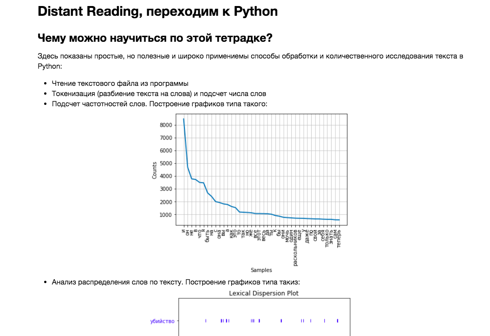
А если вдруг вместо этого ГитХаб говорит так:

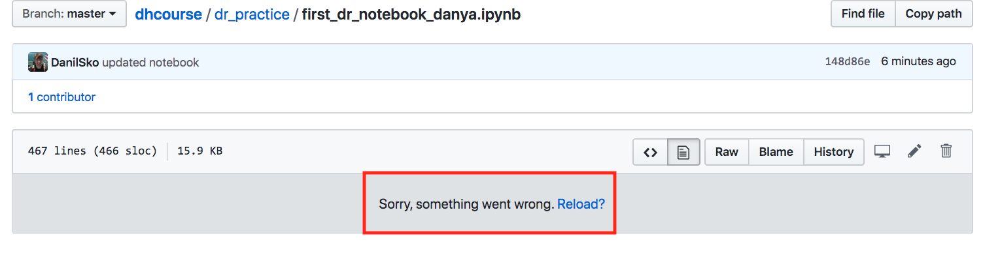
* (в последнее время на ГитХабе иногда что-то ломается с рендерингом ipynb) *

То посмотреть тетрадку можно [тут](https://nbviewer.jupyter.org/github/dhhse/dhcourse/blob/master/dr_practice/first_dr_notebook_danya.ipynb)

(но для загрузки в Google Colab, если вы решите воспользоваться им, ссылка все равно понадобится гитхабная)
